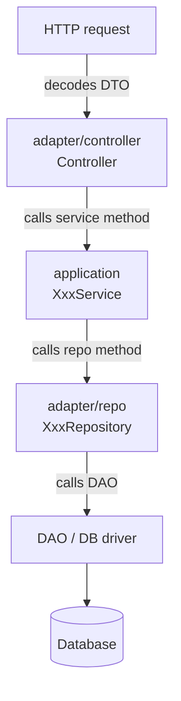
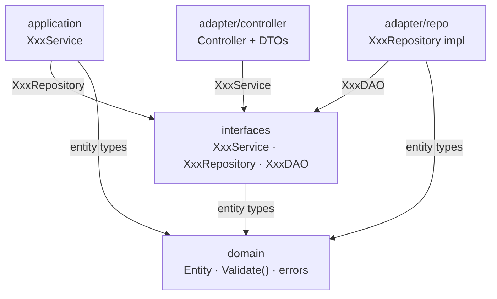
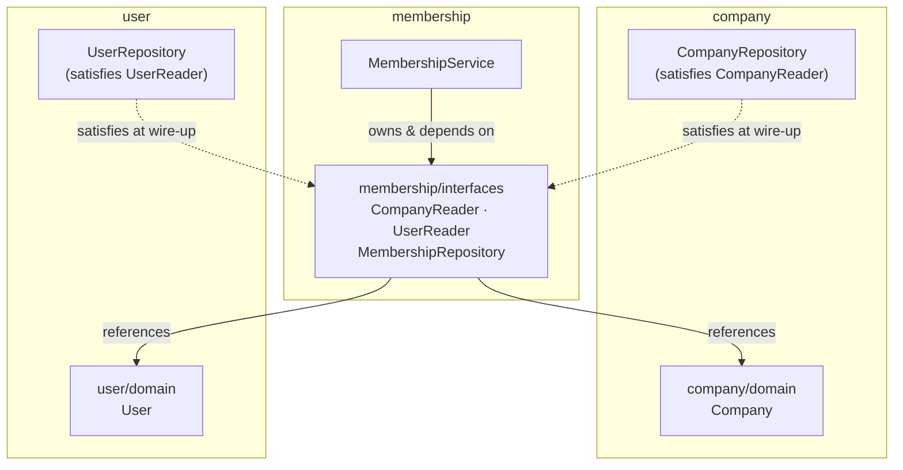
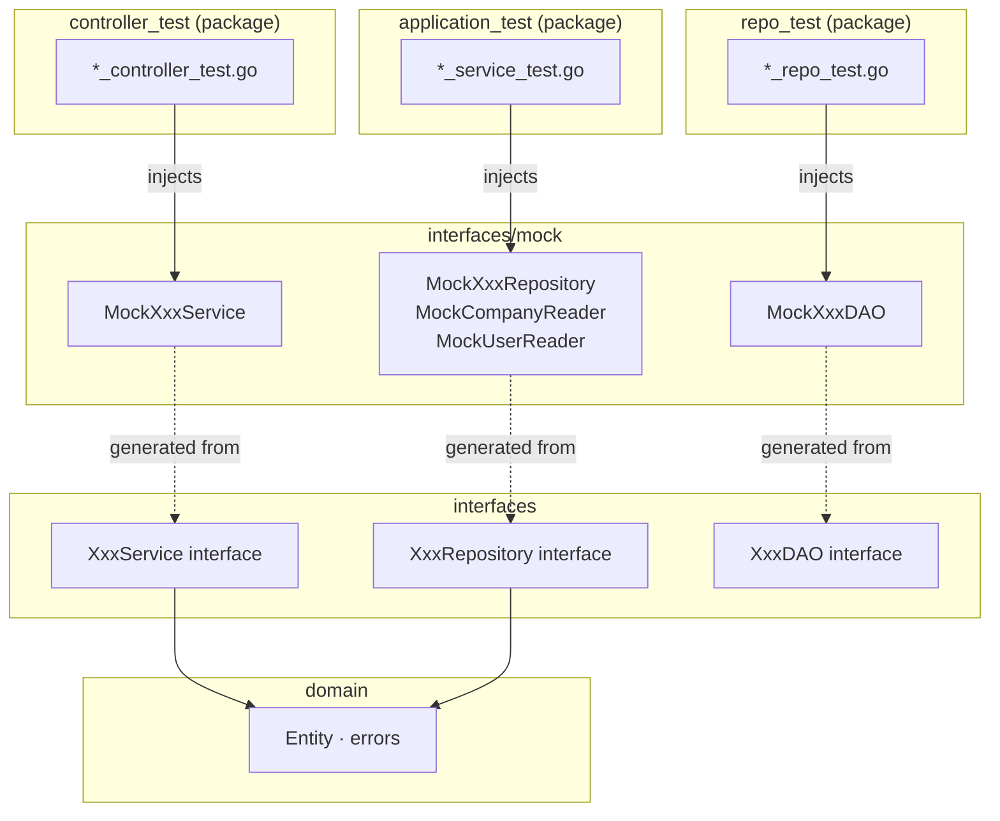

# Go Clean Architecture Training Sample

A hands-on example demonstrating vortex-backend clean architecture conventions using `company`, `user`, and `membership` as training domains.

---

## Architecture

Each domain follows a clean architecture split: business logic at the center, adapters at the edges. Dependencies flow inward — outer layers depend on inner layers, never the reverse.

### Packages per Domain

Five Go packages per domain. The two `adapter/*` packages share a parent because they're both edge adapters (transport vs persistence).

| Package | Role | Contains |
|---|---|---|
| `domain` | Pure business model | Entity, `Validate()`, domain errors |
| `interfaces` | Contracts hub | `XxxService`, `XxxRepository`, `XxxDAO` interfaces + generated mocks |
| `application` | Use cases | `XxxService` implementation |
| `adapter/repo` | Persistence adapter | `XxxRepository` impl, doc↔entity mapping |
| `adapter/controller` | Transport adapter | Controller + DTOs |

### Vocabulary

Three abbreviations show up throughout this README and the code:

| Term | Stands for | What it is | Lives in |
|---|---|---|---|
| **DTO** | Data Transfer Object | Wire-format struct (e.g. `CreateUserInput`, `UserOutput`) — what the API consumer sends and receives | `adapter/controller` |
| **doc** | document | DB-shaped struct (e.g. `userDoc`) carrying DB tags — what the persistence layer reads and writes | `adapter/repo` |
| **DAO** | Data Access Object | Thin wrapper around the DB driver (SQL, MongoDB, etc.); speaks raw DB types, not domain entities | `interfaces` (interface) + DB-driver impl outside the domain |

The three exist because each layer has a different *shape* for the same data:

```
DTO  (API/wire format)   ←→   domain.Entity   ←→   doc  (DB format)
        controller                                       repo
                              ↑
                              │
                          DAO returns raw fields,
                          repo builds the doc, maps to entity
```

This indirection is what lets the API change without breaking the schema, and the schema change without breaking the API.

### Control Flow (Runtime)

How a request actually moves through a domain at runtime. Arrows are method calls, top to bottom.



### Dependency Flow (Compile-Time)

What each package imports. Edge labels name the specific interface or types crossing the boundary. This points the *opposite* direction to control flow at the `controller→service` and `service→repo` boundaries — that's dependency inversion. The controller calls the service at runtime, but at compile time it only imports the `XxxService` interface.



Interfaces for each domain live in `interfaces/interfaces.go`. Mocks are generated from that file and placed in `interfaces/mock/`.

### Cross-Domain Communication

The `membership` domain talks to `company` and `user` without importing them. `membership/interfaces` declares narrow reader interfaces (`CompanyReader`, `UserReader`); the concrete repos in the other domains happen to satisfy them. They only meet at *wire-up* — the startup code (typically `main.go`) that constructs each concrete type and passes it where an interface is expected.



Solid arrows = compile-time imports. Dashed arrows = interface satisfaction with no import.

---

## Project Structure

```
utexample/
└── internal/
    ├── company/
    │   ├── domain/           # Company entity, Validate(), error vars
    │   ├── application/      # CompanyService (orchestrates repo)
    │   ├── adapter/
    │   │   ├── controller/   # Controller + DTOs
    │   │   └── repo/         # companyDoc, doc↔entity mapping, DAO adapter
    │   └── interfaces/       # All interfaces + generated mocks
    ├── user/
    │   ├── domain/           # User entity, Validate(), error vars
    │   ├── application/      # UserService (orchestrates repo)
    │   ├── adapter/
    │   │   ├── controller/   # Controller + DTOs
    │   │   └── repo/         # userDoc, doc↔entity mapping, DAO adapter
    │   └── interfaces/       # All interfaces + generated mocks
    └── membership/
        ├── domain/           # Membership entity, Validate(), error vars
        ├── application/      # MembershipService (coordinates company + user + repo)
        ├── adapter/
        │   ├── controller/   # Controller + DTOs
        │   └── repo/         # membershipDoc, doc↔entity mapping, DAO adapter
        └── interfaces/       # All interfaces + generated mocks (incl. CompanyReader, UserReader)
```

Tests are co-located with source files (`*_test.go` next to `*.go`).

---

## Walkthrough: the `user` Domain

One small example tracing all five packages. Each snippet is the relevant excerpt — see the actual files for the full version.

### `domain/user.go` — pure entity, no framework

```go
package domain

type User struct {
    ID    string
    Email string
    Name  string
}

func (u *User) Validate() error {
    if u.Email == "" {
        return ErrInvalidEmail
    }
    if u.Name == "" {
        return ErrInvalidName
    }
    return nil
}
```

```go
// domain/error.go
var (
    ErrUserNotFound = errors.New("user not found")
    ErrInvalidEmail = errors.New("invalid email")
    ErrInvalidName  = errors.New("invalid name")
)
```

### `interfaces/interfaces.go` — contracts, plus the mockgen directive

```go
//go:generate mockgen -source=interfaces.go -destination mock/interfaces.go -package=mock

type UserService interface {
    Create(ctx context.Context, email, name string) (string, error)
    Get(ctx context.Context, id string) (*domain.User, error)
    List(ctx context.Context) ([]*domain.User, error)
    Remove(ctx context.Context, id string) error
}

type UserRepository interface {
    Save(ctx context.Context, user *domain.User) error
    FindByID(ctx context.Context, id string) (*domain.User, error)
    // ...
}

type UserDAO interface {
    Insert(ctx context.Context, email, name string) (id string, err error)
    // ...
}
```

### `application/user_service.go` — orchestrates domain + repo

```go
func (s *UserService) Create(ctx context.Context, email, name string) (string, error) {
    u := &domain.User{Email: email, Name: name}
    if err := u.Validate(); err != nil {
        return "", err
    }
    if err := s.repo.Save(ctx, u); err != nil {
        return "", fmt.Errorf("save user: %w", err)
    }
    return u.ID, nil
}
```

The service depends only on the `interfaces.UserRepository` interface, not on the concrete repo implementation.

### `adapter/repo/user_repo.go` — DB struct stays here

```go
type userDoc struct {
    ID    string
    Email string
    Name  string
}

func docToEntity(doc *userDoc) *domain.User {
    return &domain.User{ID: doc.ID, Email: doc.Email, Name: doc.Name}
}

func (r *UserRepository) Save(ctx context.Context, user *domain.User) error {
    id, err := r.dao.Insert(ctx, user.Email, user.Name)
    if err != nil {
        return err
    }
    user.ID = id
    return nil
}
```

`userDoc` is where DB tags would live (e.g. `bson:"_id"`). The `domain.User` stays free of them.

### `adapter/controller/user_controller.go` — DTOs at the edge

```go
type CreateUserInput struct {
    Email string
    Name  string
}

type UserOutput struct {
    ID    string
    Email string
    Name  string
}

func (c *UserController) Create(ctx context.Context, input CreateUserInput) (string, error) {
    return c.svc.Create(ctx, input.Email, input.Name)
}
```

DTOs decouple the wire format from the domain entity, so renaming a domain field doesn't break API consumers (and vice versa).

---

## Testing

### Wiring

Each layer's tests mock the layer directly below it via generated mocks. Controllers test against `MockXxxService`, services against `MockXxxRepository`, repos against `MockXxxDAO`. No layer talks to a real implementation of its neighbor.



### Conventions

- **Setup helper** — each test file has `setupXxxTest(t)` returning a deps struct; gomock's `t.Cleanup` handles `Finish()`, so no `defer ctrl.Finish()` is needed
- **Naming** — `Should{Result}_When{Condition}` (e.g. `Should_ReturnNotFound_When_UserMissing`)
- **Context** — use `t.Context()` not `context.Background()` so cancellation propagates with the test

### Running

```bash
go test ./utexample/...
go test -v ./utexample/...
```

### Regenerating Mocks

```bash
go generate ./utexample/internal/company/interfaces/...
go generate ./utexample/internal/user/interfaces/...
go generate ./utexample/internal/membership/interfaces/...
# or all at once
go generate ./utexample/...
```

---

## Conventions

- **Domain-first layout** — code is organized by domain, not by layer; makes a feature easy to move or delete as a unit
- **Centralized interfaces** — all interfaces for a domain in one `interfaces/interfaces.go` so mockgen has a single source to target
- **mockgen source mode** — `mockgen -source=interfaces.go`; mocks land in `interfaces/mock/`
- **Doc↔entity mapping** — DB structs (`xxxDoc`) stay inside `adapter/repo`; domain entities carry no DB tags, keeping `domain` framework-free
- **Domain errors** — predefined error values (e.g. `var ErrUserNotFound = errors.New(…)`); callers compare with `errors.Is()`, never string matching, so error messages can change without breaking error handling

---

## Dependencies

| Package | Purpose |
|---|---|
| `github.com/golang/mock` | Mock generation and runtime |
| `github.com/stretchr/testify` | Test assertions |
