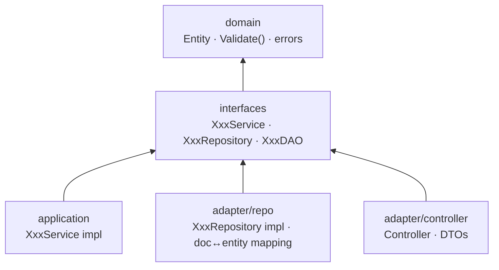
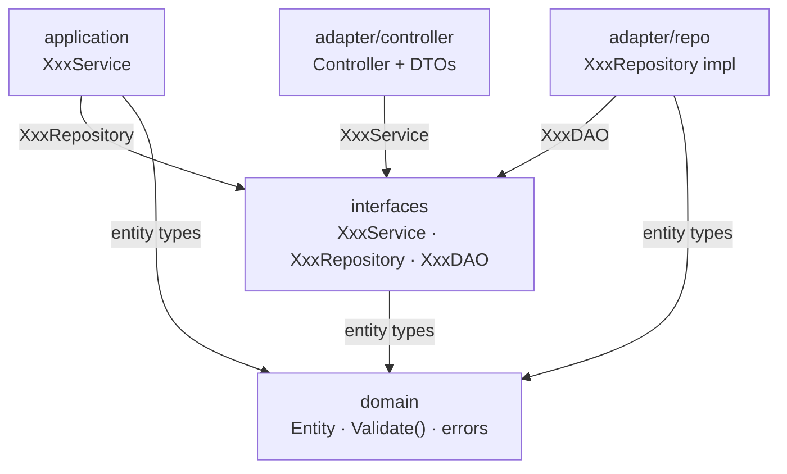
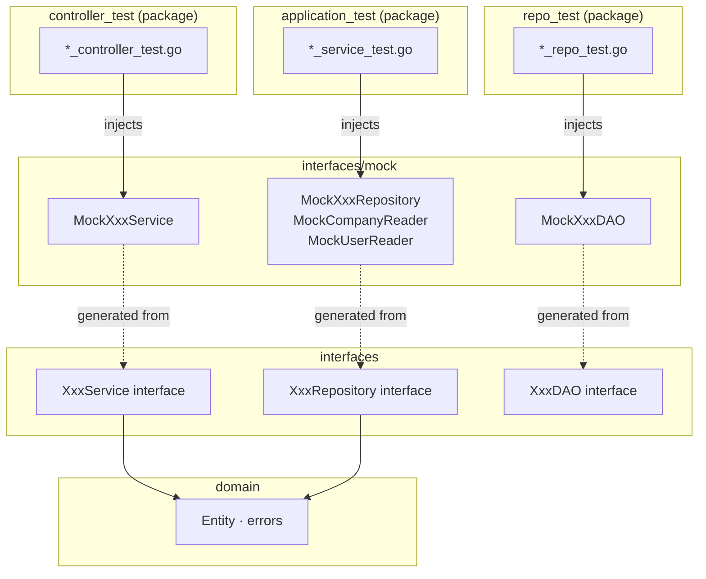
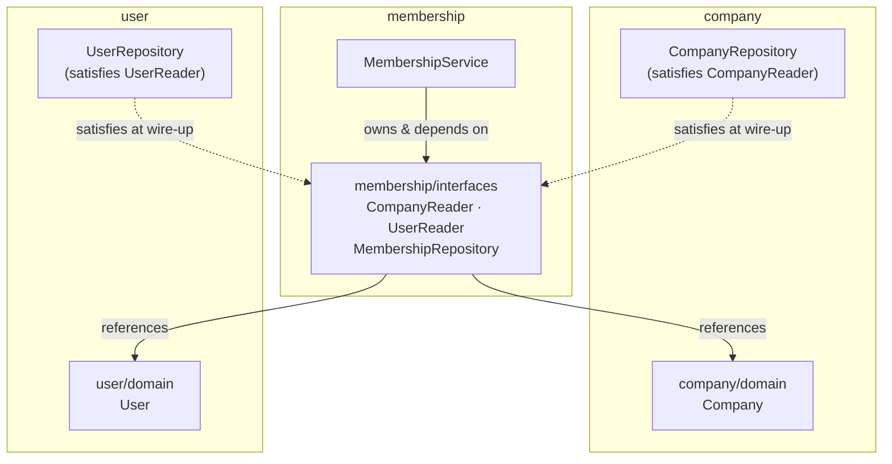

# Go Clean Architecture Training Sample

A hands-on example demonstrating vortex-backend clean architecture conventions using `company` and `user` as training domains.

---

## Architecture

Each domain follows a four-layer structure. Dependencies flow inward — outer layers depend on inner layers, never the reverse.



### Layer Dependency Flow



Interfaces for each domain live in `interfaces/interfaces.go`. Mocks are generated from that file and placed in `interfaces/mock/`.

---

## Project Structure

```
utexample/
└── internal/
    ├── company/
    │   ├── domain/           # Company entity, Validate(), error vars
    │   ├── application/      # CompanyService (orchestrates repo)
    │   ├── adapter/
    │   │   ├── controller/   # Controller + DTOs
    │   │   └── repo/         # companyDoc, doc↔entity mapping, DAO adapter
    │   └── interfaces/       # All interfaces + generated mocks
    ├── user/
    │   ├── domain/           # User entity, Validate(), error vars
    │   ├── application/      # UserService (orchestrates repo)
    │   ├── adapter/
    │   │   ├── controller/   # Controller + DTOs
    │   │   └── repo/         # userDoc, doc↔entity mapping, DAO adapter
    │   └── interfaces/       # All interfaces + generated mocks
    └── membership/
        ├── domain/           # Membership entity, Validate(), error vars
        ├── application/      # MembershipService (coordinates company + user + repo)
        ├── adapter/
        │   ├── controller/   # Controller + DTOs
        │   └── repo/         # membershipDoc, doc↔entity mapping, DAO adapter
        └── interfaces/       # All interfaces + generated mocks (incl. CompanyReader, UserReader)
```

Tests are co-located with source files (`*_test.go` next to `*.go`).

### Test Module Wiring

Each layer's tests mock the layer directly below it via generated mocks.



---

## Key Conventions

- **Domain-first layout** — code is organized by domain, not by layer
- **Centralized interfaces** — all interfaces for a domain in one `interfaces/interfaces.go`
- **mockgen source mode** — `mockgen -source=interfaces.go`; mocks in `interfaces/mock/`
- **Doc↔entity mapping** — DB structs stay in the adapter; domain entities have no DB tags
- **Domain errors** — `errors.Is()` for comparison, never string matching
- **Test setup struct** — `setupXxxTest(t)` returns a deps struct; no `defer ctrl.Finish()`
- **Test naming** — `Should{Result}_When{Condition}`
- **Context in tests** — `t.Context()` not `context.Background()`

---

## Cross-Domain Communication

The `membership` domain demonstrates how domains communicate without direct coupling:

- `membership/interfaces` defines narrow `CompanyReader` and `UserReader` interfaces
- At wire-up, `*companyrepo.CompanyRepository` and `*userrepo.UserRepository` satisfy these interfaces
- Neither `company` nor `user` imports from `membership`
- `MembershipService` depends only on interfaces it owns — not on other domains' packages

### Cross-Domain Dependency



Solid arrows = compile-time imports. Dashed arrows = interface satisfaction (no import from company/user into membership).

---

## Running Tests

```bash
go test ./utexample/...
go test -v ./utexample/...
```

---

## Regenerating Mocks

```bash
go generate ./utexample/internal/company/interfaces/...
go generate ./utexample/internal/user/interfaces/...
go generate ./utexample/internal/membership/interfaces/...
# or all at once
go generate ./utexample/...
```

---

## Dependencies

| Package | Purpose |
|---|---|
| `github.com/golang/mock` | Mock generation and runtime |
| `github.com/stretchr/testify` | Test assertions |
